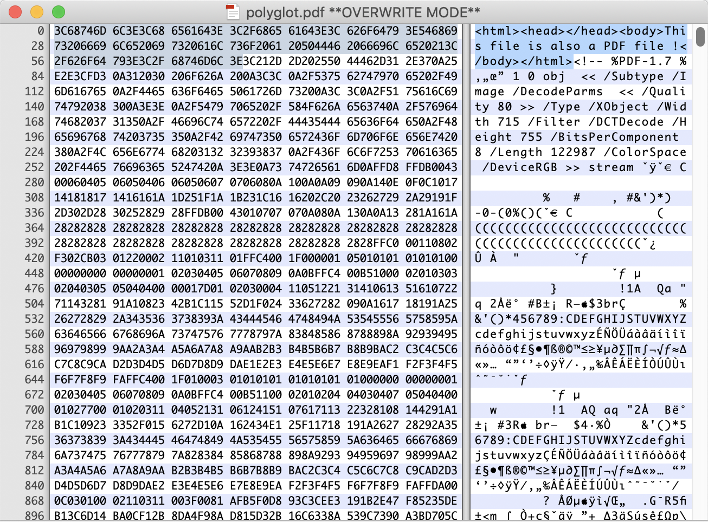

# Simple Polyglot File

My Polyglot file can convert between PDF and HTML.

Using the hex file editor to edit the PDF file.

### Implementation:

```
<html>
Insert HTML content here
</html>
<!--
Insert PDF raw data here
-->
```
> - Using html comment the cover all the pdf content, so browser would onlde print out the HTML content. And if convert to PDF file, pdf file reader would start read the data from the pdf header which is %PDF.
> - For some pdf reader the header of pdf (%PDF) should be read within the first 1024 characters. If the html content is too large, some pdf reader would fail to read this PDF.

#### For example:


#### Reference: https://www.alchemistowl.org/pocorgtfo/pocorgtfo11.pdf 